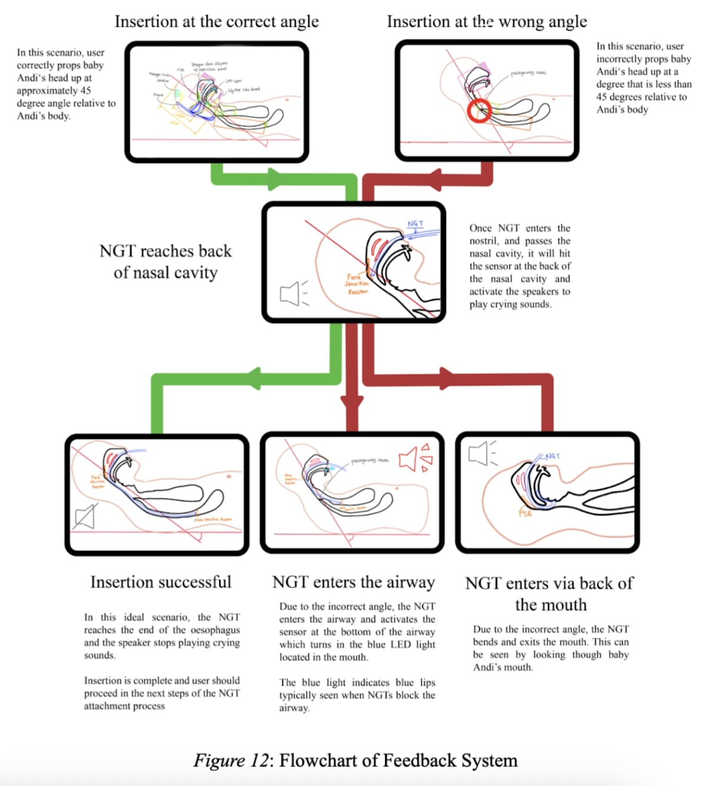
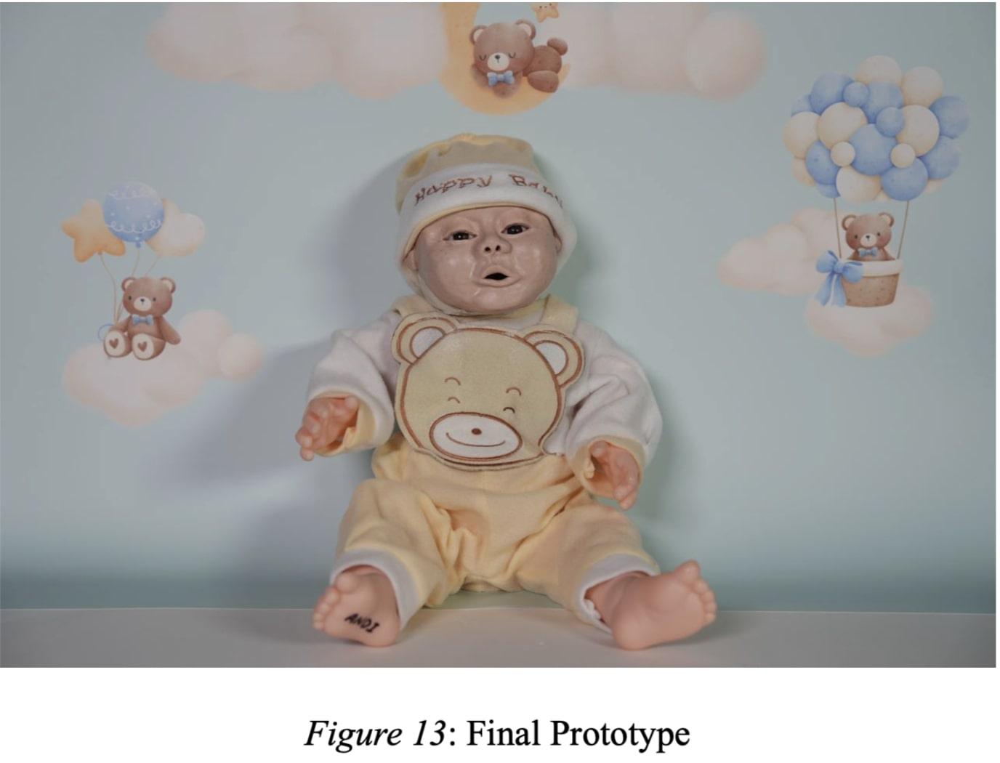

# Baby ANDI — Infant Training Mannequin (iDP)

**Summary:** A higher-fidelity infant training mannequin prototype designed to improve caregiver practice using real-time feedback.

---

## Problem
Caregivers and trainees need realistic practice for infant tube insertion procedures. Many training mannequins lack realism and do not provide clear feedback during practice.

## Solution
A training mannequin prototype that recreates key anatomy and provides **visual/audio feedback** to reinforce correct technique during practice.

## How it works (high level)
- Sensors detect insertion progress at key checkpoints
- A microcontroller processes inputs
- Feedback is provided via simple indicators (e.g., LEDs/audio cues)

## My contributions
- Research and ideation 
- Consolidated stakeholder requirements into system features and training scenarios
- Supported prototype integration/testing and iteration
- Prepared documentation and presentations for design reviews

## Media

